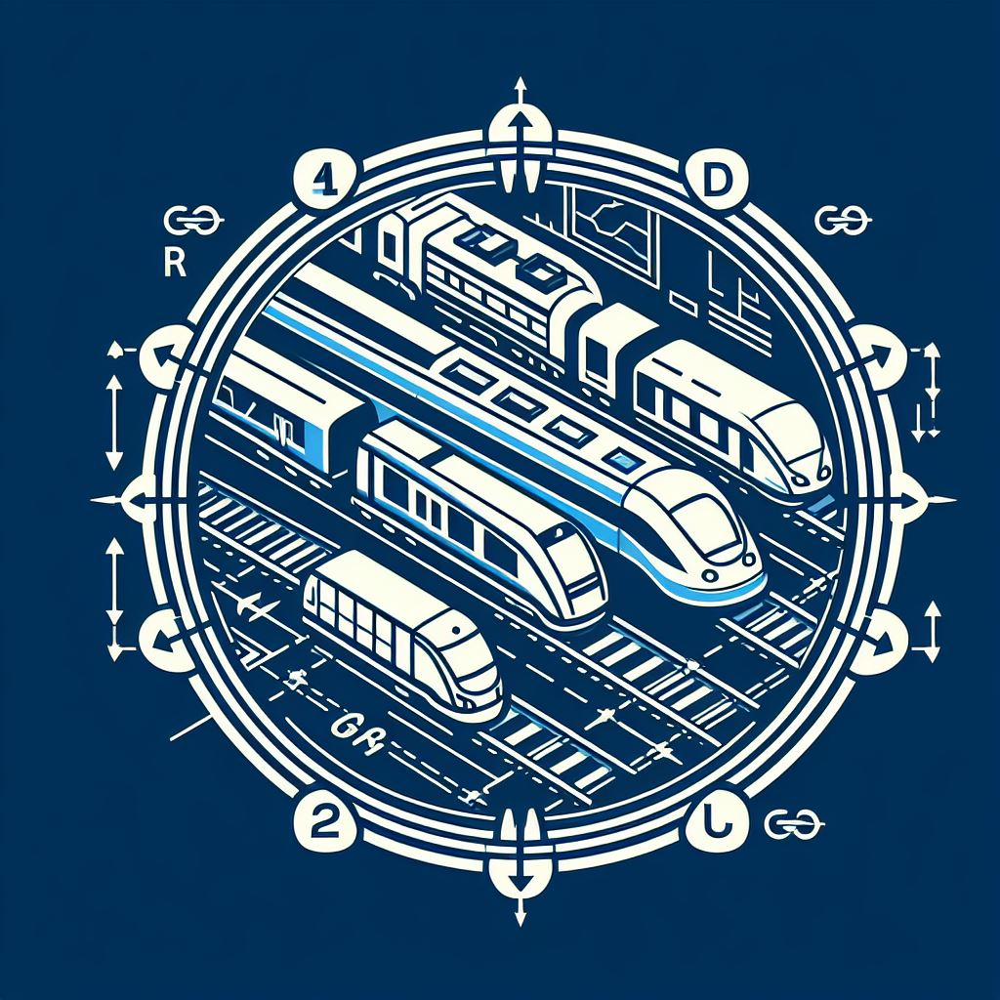
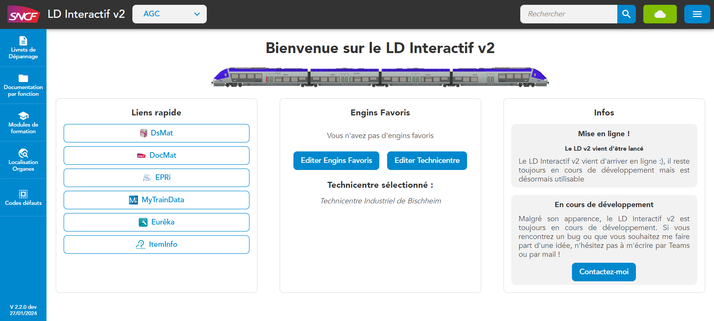

<!-- PROJECT SHIELDS -->
[![Contributors][contributors-shield]][contributors-url]
[![Stargazers][stars-shield]][stars-url]
[![Issues][issues-shield]][issues-url]
[![LinkedIn][linkedin-shield]][linkedin-url]

<!-- PROJECT LOGO -->
 

  

<h3 align="center">Livret de Dépannages V2</h3>

  

    A advanced documentary platform
     
    <a href="https://github.com/lorisvila/LDv2_Angular"><strong>Explore the docs »</strong></a>
     
     
    
     
     
    <a href="https://github.com/lorisvila/LDv2_Angular/issues">Report Bug</a>
    ·
    <a href="https://github.com/lorisvila/LDv2_Angular/issues">Request Feature</a>
  

### Built With

- `wcs-core` - 
- `angular` - 

(<a href="#readme-top">back to top</a>)

<!-- USAGE EXAMPLES -->
## Project

### Context

The Bischheim maintenance center started the mid-life operation on regional trains "AGC" in 2022. For this maintenance center, it is the first time that they deal with this type of trains (they were dealing only with TGV mid-life operations for more than 20 years).
The employees were using a tool called "LD Interactif" which was just multiple Excel sheets exported as html documents linking to PDF documents.

Dealing with documents this way meant to publish a new version of the app whenever a technical document was updated. But the tool was unfortunately never updated, which led the user to wether **use outdated docs** or to **manually search the new version of it** on our intern documentation platform...

Those problems were also noticed in other maintenance centers, which meant that a new tool needed to be created.

### Solution

To be able to deal with the arrival of this new generation of trains in our maintenance centers, I decided to start a new version of this "LD Interactif". But I wanted to do it the right way by following those specifications, so the tool must : 

* Handle data in a database to be able to maintain the app whenever a document is updated
* Be able to redirect to our intern documentation platform to let the user retrieve the data from the original source
* Be able to serve the document offline when the user uses the app on a train where there is no internet connection available
* Have the "SNCF Métier" UI and UX to help familiarisation with the tool
* Implement an advanced (but still simple to familiarise with) search engine on all the website records / resources (global search)

(<a href="#readme-top">back to top</a>)
 

<!-- ROADMAP -->
## Roadmap

- [ ] Deploy it in a stable version to be able to beta test the app with the SNCF maintenance center staff
- [ ] Make a stable Electron version of the app
  - [ ] Add the automatic update of documents in the Electron app
  - [ ] Create a custom UI to open PDF documents in the app
- [ ] Implement the "Code défauts" and "Location des organes" sections 
- [ ] Make a documentation for the API & electron app

See the [open issues](https://github.com/github_username/repo_name/issues) for a full list of proposed features (and known issues).

(<a href="#readme-top">back to top</a>)

<!-- CONTRIBUTING -->
## Contributing

Contributions are what make the open source community such an amazing place to learn, inspire, and create. Any contributions you make are **greatly appreciated**.

If you have a suggestion that would make this better, please fork the repo and create a pull request. You can also simply open an issue with the tag "enhancement".
Don't forget to give the project a star! Thanks again!

1. Fork the Project
2. Create your Feature Branch (`git checkout -b feature/AmazingFeature`)
3. Commit your Changes (`git commit -m 'Add some AmazingFeature'`)
4. Push to the Branch (`git push origin feature/AmazingFeature`)
5. Open a Pull Request

(<a href="#readme-top">back to top</a>)

<!-- LICENSE -->
## License

This app is the property of the french SNCF company, the source code is open but the usage by other companies is strictly forbidden.

(<a href="#readme-top">back to top</a>)

<!-- CONTACT -->
## Contact

VILA Loris - loris.vila@sncf.fr

Project Link: [https://github.com/lorisvila/LDv2_Angular](https://github.com/lorisvila/LDv2_Angular)

(<a href="#readme-top">back to top</a>)

<!-- MARKDOWN LINKS & IMAGES -->
<!-- https://www.markdownguide.org/basic-syntax/#reference-style-links -->
[contributors-shield]: https://img.shields.io/github/contributors/lorisvila/LDv2_Angular.svg?style=for-the-badge
[contributors-url]: https://github.com/lorisvila/LDv2_Angular/graphs/contributors
[stars-shield]: https://img.shields.io/github/stars/lorisvila/LDv2_Angular.svg?style=for-the-badge
[stars-url]: https://github.com/lorisvila/LDv2_Angular/stargazers
[issues-shield]: https://img.shields.io/github/issues/lorisvila/LDv2_Angular.svg?style=for-the-badge
[issues-url]: https://github.com/lorisvila/LDv2_Angular/issues
[linkedin-shield]: https://img.shields.io/badge/-LinkedIn-black.svg?style=for-the-badge&logo=linkedin&colorB=555
[linkedin-url]: https://linkedin.com/in/loris-vila

[product-screenshot]: docs/images/homePageScreenshot.png
[logo]: docs/images/LDv2-logo.jpg
